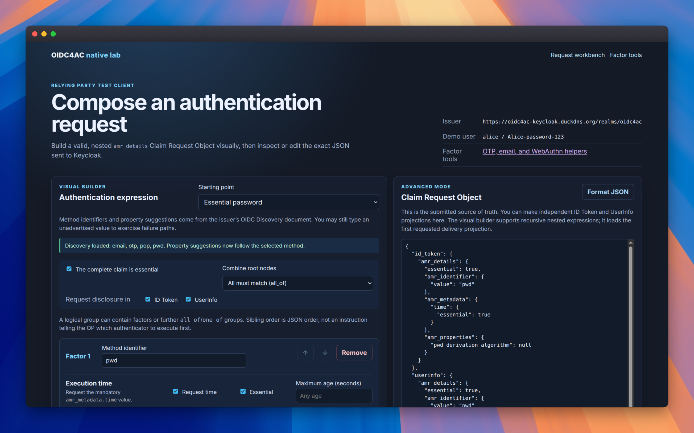

Failed to create stream fd: Operation not permitted
Failed to create stream fd: Operation not permitted
Failed to create stream fd: Operation not permitted
# OIDC4AC on Keycloak: Reproducible Research Artifact

This repository contains the two software artifacts evaluated in the associated
paper: an experimental OIDC4AC implementation for Keycloak and a self-contained
laboratory that exercises it through a relying-party test client, an example
authentication SPI, and automated HTTP/browser scenarios.

## Summary

**Associated paper title:** OIDC4AC: Extending OpenID Connect for Structured and Negotiable Authentication Contexts

**Associated paper abstract:**

> OpenID Connect (OIDC) is a widely adopted authentication protocol on the web.
> Despite its popularity, it provides limited expressiveness for describing how
> users are authenticated, constraining its applicability in high-assurance,
> auditable scenarios. To understand the extent of this gap, a Multivocal
> Literature Review was conducted, revealing the absence of an integrated,
> OIDC-native model for representing factors and specifying authentication
> requirements. To address these gaps, this paper proposes OpenID Connect for
> Authentication Context (OIDC4AC), a new OIDC protocol extension that enables
> fine-grained specification and detailed representation of authentication
> factors, improving interoperability and auditability.

The artifact demonstrates how
[OpenID Connect for Authentication Context (OIDC4AC)](https://bredstone.github.io/oidc4ac/)
can express authentication requirements and return a verifiable description of
the methods actually used. The Keycloak implementation supports recursive
`all_of`/`one_of` requirements, Discovery, ID Token/UserInfo projections,
disclosure policy, browser-factor planning, and extensibility through a private
authentication-method-details SPI.

The artifact is a disposable research environment, not a production Keycloak
distribution or a protocol-conformance certification.

The submission uses one primary public repository. The companion link records
the public origin of the pinned Keycloak source; it is not a second submission
URL.

- **Primary artifact repository:** [Bredstone/Keycloak-OIDC4AC-Lab (`sbseg2026-artifact` branch)](https://github.com/Bredstone/Keycloak-OIDC4AC-Lab/tree/sbseg2026-artifact), which contains the lab, test client, provider fixture, tests, and documentation.
- **Companion implementation repository:** [Bredstone/keycloak-OIDC4AC](https://github.com/Bredstone/keycloak-OIDC4AC/tree/oidc4ac-implementation), which contains the modified Keycloak implementation. The reviewed source is pinned to commit [ec3fd9d](https://github.com/Bredstone/keycloak-OIDC4AC/commit/ec3fd9d3cedc7ad4b347256a0ab30116cb3b8fcc).

## Repository structure

The branch contains the laboratory and the reviewed Keycloak source as the
`keycloak-oidc4ac/` submodule. The companion repository listed above is the
source of that pinned submodule:

- `keycloak-oidc4ac/` — a Git submodule pinned to the reviewed Keycloak
  implementation commit (`ec3fd9d`) on the
  `oidc4ac-implementation` branch.
- `config/` — the disposable `oidc4ac` realm import.
- `test-client/` — the Flask relying-party workbench.
- `providers/oidc4ac-test-email/` — an example Keycloak authenticator and
  OIDC4AC details provider.
- `e2e/` and `tests/` — HTTP, browser, and feature-gate checks.
- `scripts/` and `dev.sh` — build, lifecycle, verification, and test
  automation.
- `docs/` — user and implementation documentation.
- `submission/` — reviewer-facing artifact notes and the claims checklist.

Generated Keycloak distributions, Maven caches, provider JARs, and test runtime
state are created under ignored `.build/`, `.runtime/`, and `target/`
directories. They are not required in the repository. Reviewer-specific
information is collected in the [artifact appendix](submission/appendix.md).

## Seals considered

This submission requests all four artifact seals:

- **Available (SeloD):** both artifacts are available from this stable
  repository; the Keycloak implementation is pinned as a submodule.
- **Functional (SeloF):** a clean Docker-based installation, a minimal smoke
  test, an interactive workbench, and automated HTTP/browser scenarios are
  provided.
- **Sustainable (SeloS):** the implementation is modular, the SPI boundary is
  documented, the repository structure is explicit, and the main claims map to
  reproducible commands.
- **Reproducible Experiments (SeloR):** the claim-oriented experiment commands
  below automate the build and verification of the main protocol and
  integration behaviors.

## Basic information

### Execution environment

The artifact was designed for a clean Linux, macOS, or Windows host with:

- Docker Engine and Docker Compose v2;
- Git with submodule support;
- `curl`;
- internet access for Docker images and Maven dependencies;
- at least 4 CPU cores, 8 GB RAM, and 15 GB of free disk space; and
- a browser for the interactive test-client flow.

Java, Maven, Python, and Node.js are provided inside Docker build/test
environments and are not required on the host. The default services bind only to
localhost-compatible hostnames and ports. The regular client and end-to-end
profiles use Docker host networking so the loopback-only binding is preserved;
the Docker runtime must support host networking.

### Default services

| Service | Address | Purpose |
| --- | --- | --- |
| Keycloak | `http://keycloak.localhost:8080` | OIDC provider and Admin Console |
| Test client | `http://client.localhost:5000` | OIDC4AC relying-party workbench |
| smtp4dev | `http://localhost:5080` | Disposable email inbox |
| Browser profile | ports 8186/5003 | Isolated virtual-WebAuthn run |

The default test credentials are `alice / Alice-password-123` and
`admin / admin`. They are disposable credentials and must not be reused
outside this artifact.

## Optional hosted demonstration

Reviewers may use the [hosted demonstration guide](docs/hosted-demo.md) to
publish a disposable VM-backed instance with HTTPS. The hosted instance is a
convenience for interactive review; the repository and local claim commands
remain the authoritative, reproducible artifact.

## Dependencies

The main versions used by this artifact are:

| Dependency | Version or source |
| --- | --- |
| Keycloak implementation | `keycloak-oidc4ac` submodule at the pinned review commit |
| Keycloak distribution | 26.7.0 |
| Maven builder | `maven:3.9-eclipse-temurin-21` |
| Python test/client images | versions pinned in their Dockerfiles and requirements files |
| Email sink | `rnwood/smtp4dev:v3` |
| Browser test | Chromium with a virtual CTAP2/WebAuthn authenticator |

The test client and end-to-end Python dependencies are declared in
`test-client/requirements.txt`, `e2e/http/requirements.txt`, and
`e2e/browser/requirements.txt`. The optional host lint dependencies are listed
in `requirements-dev.txt`.

## Security concerns

This artifact intentionally starts a disposable development environment:

- the default Keycloak administrator password is `admin`;
- the realm contains test users, a test client secret, and a disposable OTP
  fixture;
- smtp4dev accepts and displays test email messages;
- the Flask client uses a development secret unless overridden; and
- `./dev.sh run` stops this lab's Compose services by default.

Run the artifact only on an isolated local or disposable machine. Do not expose
the services to the public internet, do not reuse the credentials or OTP seed,
and use `./dev.sh run --no-kill` if other local containers must be preserved.
The implementation does not claim production hardening, hardware WebAuthn
coverage, or multi-node failover validation.

## Installation

Clone the primary artifact repository:

```bash
git clone --branch sbseg2026-artifact https://github.com/Bredstone/Keycloak-OIDC4AC-Lab.git
cd Keycloak-OIDC4AC-Lab
git submodule update --init --recursive
```

This artifact branch uses the pinned Keycloak submodule. If a checkout does not
contain the submodule, the helper falls back to the reviewed commit
`ec3fd9d3cedc7ad4b347256a0ab30116cb3b8fcc`. To use a different local checkout,
set `OIDC4AC_LAB_KEYCLOAK_REPO` before starting the build.

Start the complete laboratory:

```bash
./dev.sh run
```

The first run downloads Docker/Maven dependencies, builds the Keycloak
distribution from the pinned submodule (or from the managed `.runtime` checkout
when using the primary lab repository), compiles the example email provider,
imports the disposable realm, and starts the test client and smtp4dev. Expect
the first build to take several minutes and use several gigabytes of temporary
disk space.

For a non-interactive preparation:

```bash
./dev.sh build
./dev.sh provider-build
```

## Minimal test

After installation, run the smoke check:

```bash
./dev.sh verify
```

The command starts the local services and checks that Keycloak and the test
client respond, that the OIDC Discovery document is available, and that the
OIDC4AC capabilities are advertised.

For a manual functional check:

1. Open <http://client.localhost:5000>.
2. Keep the **Essential password** preset and start authorization.
3. Sign in as `alice` / `Alice-password-123`.
4. Confirm the result page contains `amr_details` with the `pwd` identifier and
   an execution timestamp.
5. Try a `pwd + otp` preset and read the current code from the test client's
   OTP helper.



Stop the environment with:

```bash
./dev.sh down
```

## Experiments

The following experiments correspond to the main artifact claims. Commands are
run from the repository root after installation. Each experiment is automated
and can be run independently after the required build step.

### Claim 1 — OIDC4AC request, evaluation, and disclosure

**Command:**

```bash
./dev.sh test-http
```

**Expected resources:** 4 CPU cores, 8 GB RAM, 15 GB free disk; approximately
5–15 minutes after images and Maven dependencies are cached.

**Expected result:** the HTTP suite completes its authorization-code scenarios
covering Discovery, password/OTP requirements, recursive `all_of`/`one_of`,
constraints, ID Token/UserInfo projections, snapshots, refresh, disclosure
policy, and generic requirement failures.

See [Usage flows](docs/usage-flows.md) and
[Protocol alignment](docs/protocol-alignment.md) for the expected protocol
behavior.

### Claim 2 — Browser factor planning and passkey support

**Command:**

```bash
./dev.sh test-browser
```

**Expected resources:** 4 CPU cores, 8 GB RAM, 15 GB free disk; approximately
5–15 minutes after the regular Keycloak build is cached.

**Expected result:** the isolated browser profile starts Keycloak on port 8186
and the test client on port 5003, then exercises configured factor planning,
OTP, passkey/WebAuthn `pop` mapping, alternative-branch behavior, and explicit
user cancellation.

See [Browser factor planning](docs/browser-factor-planning.md).

### Claim 3 — Custom authentication-method extensibility

**Commands:**

```bash
./dev.sh provider-build
./dev.sh test-http
```

**Expected resources:** the same environment as Claim 1; provider compilation
normally takes under 5 minutes after Maven dependencies are cached.

**Expected result:** the `oidc4ac-test-email` JAR is compiled against the
pinned Keycloak SPI, loaded into the server, advertised through Discovery, and
used by the email factor. The resulting `amr_details` contains only the
safe `email_verification_method: code` property.

See [Creating a custom authentication method with the SPI](docs/custom-authentication-spi.md).

### Claim 4 — Feature isolation and ordinary OIDC behavior

**Command:**

```bash
./dev.sh test-disabled
```

**Expected resources:** 4 CPU cores, 8 GB RAM, 10 GB free disk; approximately
5–10 minutes on a cold Docker/Maven cache.

**Expected result:** the feature-disabled profile does not advertise or process
OIDC4AC requests while the ordinary Keycloak/OIDC paths remain available.

### Claim 5 — Artifact integrity and code quality

**Commands:**

```bash
./dev.sh lint
./dev.sh status
```

**Expected resources:** 2 CPU cores, 4 GB RAM, and 5 GB free disk; normally
under 5 minutes after dependencies are cached. Host lint dependencies must be
installed with `python3 -m pip install -r requirements-dev.txt`.

**Expected result:** Compose, Python, shell, realm JSON, provider XML, and
provider formatting checks pass, and `status` reports the selected bundled
Keycloak source and local services.

## LICENSE

The laboratory code and documentation in this repository are distributed under
the Apache License 2.0; see [LICENSE](LICENSE). The
`keycloak-oidc4ac/` submodule retains the upstream Keycloak license and
notices in that source tree.
