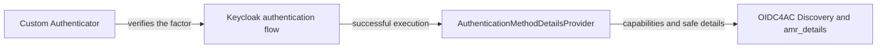

# Creating a custom authentication method with the SPI

OIDC4AC does not limit a realm to Keycloak's native methods. In this
implementation, a provider can add a custom method, make it appear in
Discovery, and allow its execution to be described in `amr_details`.

The [oidc4ac-test-email](../providers/oidc4ac-test-email) project is the
executable example. It adds the `email` method: an authenticator sends and
validates a code, while an OIDC4AC provider declares the `email` capability
and publishes the safe `email_verification_method: code` property after a
successful execution.

## Separate authentication from description

There are two complementary responsibilities:

1. A normal Keycloak `Authenticator` verifies the factor. In the example, it
   sends and checks the email code.
2. An OIDC4AC `AuthenticationMethodDetailsProvider` describes only an
   execution that has already succeeded: method identifier, time, metadata, and
   properties that can be proven.

The second component does not authenticate the user and must not receive or
publish secrets. Passwords, OTP codes, WebAuthn credential IDs, keys, and other
replayable artifacts must never appear in `amr_details`.

## Implementation path

Start with the email provider and adapt it for your method:

1. implement and register an `AuthenticatorFactory` for the authenticator;
2. implement and register an `AuthenticationMethodDetailsProviderFactory` for
   capabilities and successful-execution details;
3. declare both factories under `META-INF/services/`;
4. keep Keycloak dependencies in `provided` scope, so the JAR does not package
   server classes;
5. install the JAR in the Keycloak distribution's `providers/` directory and
   restart the server; and
6. add a browser-flow subflow named `oidc4ac:<identifier>` that executes the
   authenticator.

The lab builds and installs the example with `./dev.sh provider-build` and
`./dev.sh run`. For your own distribution, handle the JAR like any other
Keycloak provider and always compile it against the same fork version that will
run it.

## What the SPI must provide

The details provider declares the identifier and properties it can produce.
This feeds Discovery and the test-client builder. When the authenticator
succeeds, it returns only factual values that are permitted by the realm/client
disclosure policy.

Read the example in this order:

- [Authenticator factory](../providers/oidc4ac-test-email/src/main/java/org/keycloak/testsuite/authentication/OIDC4ACEmailAuthenticatorFactory.java)
- [Email authenticator](../providers/oidc4ac-test-email/src/main/java/org/keycloak/testsuite/authentication/OIDC4ACEmailAuthenticator.java)
- [OIDC4AC details provider](../providers/oidc4ac-test-email/src/main/java/org/keycloak/testsuite/authentication/OIDC4ACEmailAuthenticationMethodDetailsProviderFactory.java)
- [Service provider registrations](../providers/oidc4ac-test-email/src/main/resources/META-INF/services/)

The contract remains experimental and lives in the fork's private SPI. This
means it has no compatibility guarantee between Keycloak versions. Disclosure
and evidence rules are in [Protocol alignment](protocol-alignment.md).
