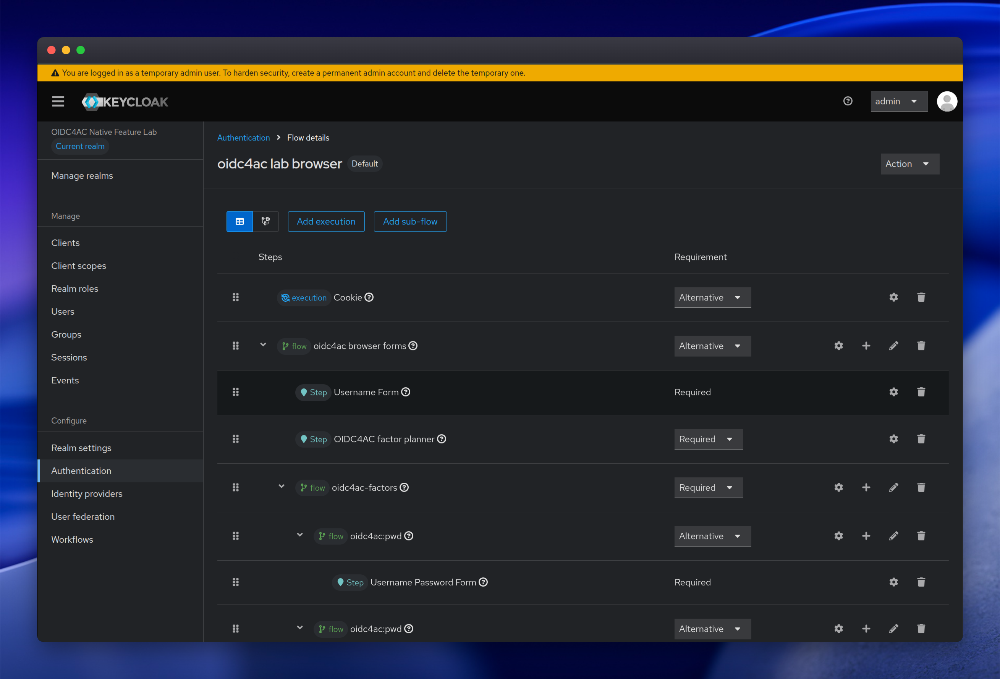
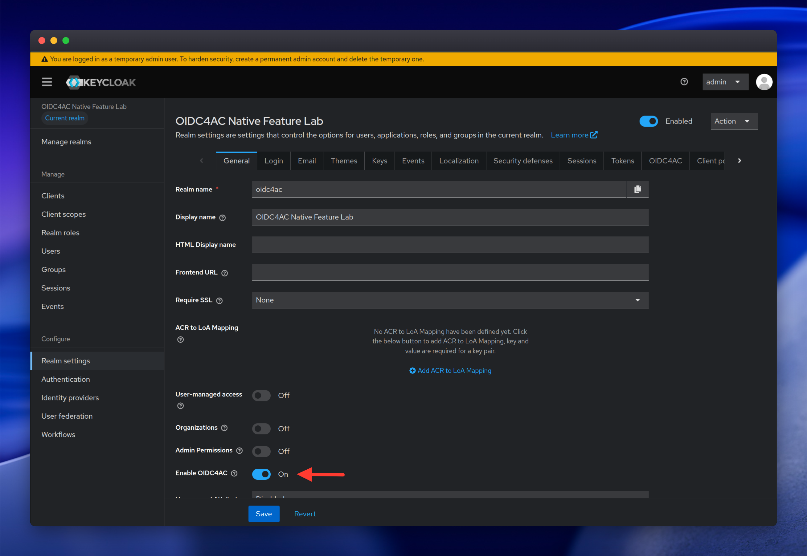
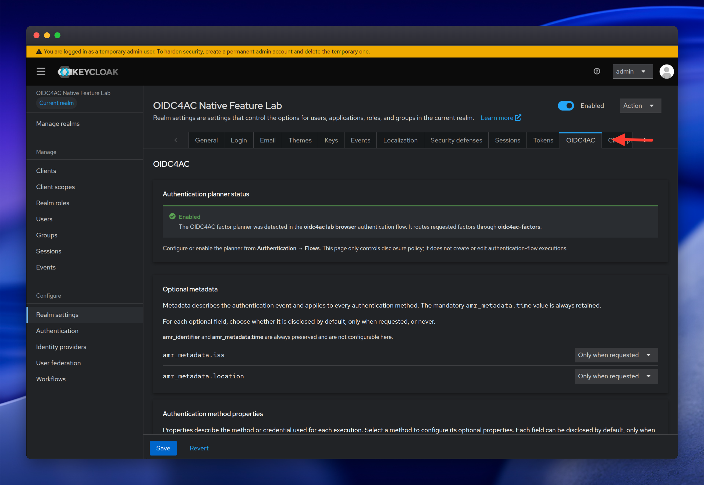

# OIDC4AC integration in Keycloak

This lab uses the [keycloak-OIDC4AC](https://github.com/Bredstone/keycloak-OIDC4AC/tree/oidc4ac-implementation)
fork. It adds OIDC4AC as the experimental `oidc4ac:v1` feature, so it cannot
be enabled in an ordinary official Keycloak distribution without this
implementation.

## What the implementation adds

In a normal OIDC authorization, an RP requests sign-in and receives tokens.
With OIDC4AC, the RP can also send requirements in the `amr_details` claim,
inside the OIDC `claims` parameter. The Keycloak implementation then:

1. validates the request and combines the ID Token and UserInfo requirements;
2. selects, from factors the administrator has already configured, those that
   can satisfy the request;
3. lets Keycloak's normal authenticators verify each factor;
4. creates an immutable record of the methods that succeeded; and
5. returns a safe projection of that record in the ID Token and/or UserInfo.

For example, an application can request `pwd` and `otp`, or an alternative
among `pwd`, `otp`, `pop`, and a custom method such as `email`. The request
does not create flows, install providers, or decide factor priority; those are
realm-administrator decisions.

An OIDC request without `amr_details` keeps its ordinary OIDC behavior.

## The lab realm

`./dev.sh run` imports the `oidc4ac` realm and enables the feature. It includes
a browser flow named **oidc4ac lab browser**, with the OIDC4AC planner and
subflows prepared for these methods:

| Identifier | Configured factor | Lab use |
| --- | --- | --- |
| `pwd` | username and password form | basic Alice sign-in |
| `otp` | TOTP | code displayed by the test client |
| `pop` | WebAuthn/passkey | browser scenario with a virtual authenticator |
| `email` | authenticator installed by the example SPI | code delivered to smtp4dev |

The planner selects only existing subflows. Naming `email` in a request is
therefore not enough: the provider must be installed and the
`oidc4ac:email` subflow must be configured in the browser flow.

<!-- Screenshot placeholder: add docs/images/keycloak-browser-flow.png. -->

## Configure your own instance

For an installation based on this fork:

1. start Keycloak with `--features=oidc4ac:v1`;
2. enable OIDC4AC for the realm in **Realm settings → General**;
3. create a browser flow containing the **OIDC4AC factor planner** and a
   required factor container;
4. add an alternative subflow for every allowed method, using the alias
   `oidc4ac:<identifier>`; and
5. verify the Discovery document before integrating an RP.

In this lab, [realm-import.json](../config/realm-import.json) configures these
items automatically. In a real deployment, also define the realm disclosure
policy and, when necessary, an override per client. They determine which
optional metadata and properties can be sent to each RP.

<!-- Screenshot placeholder: add docs/images/keycloak-oidc4ac-settings.png. -->

<!-- Screenshot placeholder: add docs/images/keycloak-disclosure-policy.png. -->

[Browser factor planning](browser-factor-planning.md) explains the flow
structure and alternative rules. The [configuration reference](configuration-reference.md)
contains ports, environment variables, and the local lifecycle.

## Important features and boundaries

- Discovery tells an RP whether the server accepts OIDC4AC requests and which
  methods and properties it can offer. The test client reads this document at
  runtime.
- `all_of` requires every factor; `one_of` accepts one alternative. The order
  sent by the RP does not control execution order.
- The authentication event retains the methods that were actually used. The ID
  Token and UserInfo may disclose different optional subsets, but they refer to
  the same event.
- Essential requirements that cannot be satisfied fail generically. The server
  must not reveal whether the reason was a missing credential, unavailable
  method, or disclosure policy.
- The implementation is experimental. This lab is not a production recipe and
  does not cover every storage, cluster, JWE, or physical-authenticator
  combination.

For the protocol contract and verified behavior, read
[Protocol alignment](protocol-alignment.md). To extend the method catalog, see
[Creating a custom authentication method with the SPI](custom-authentication-spi.md).
