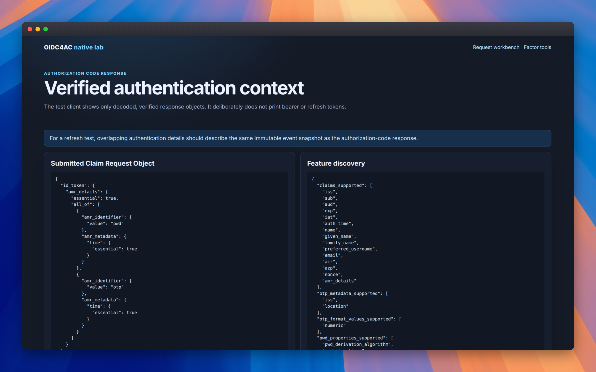
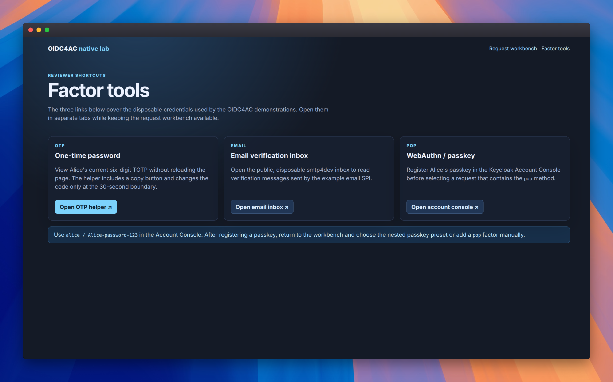
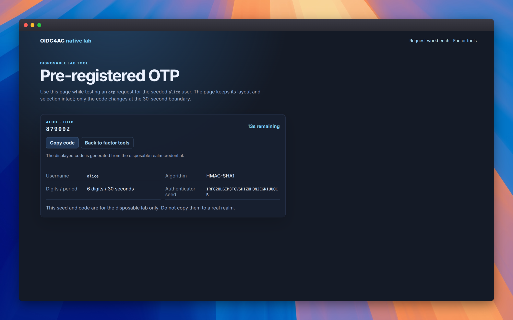
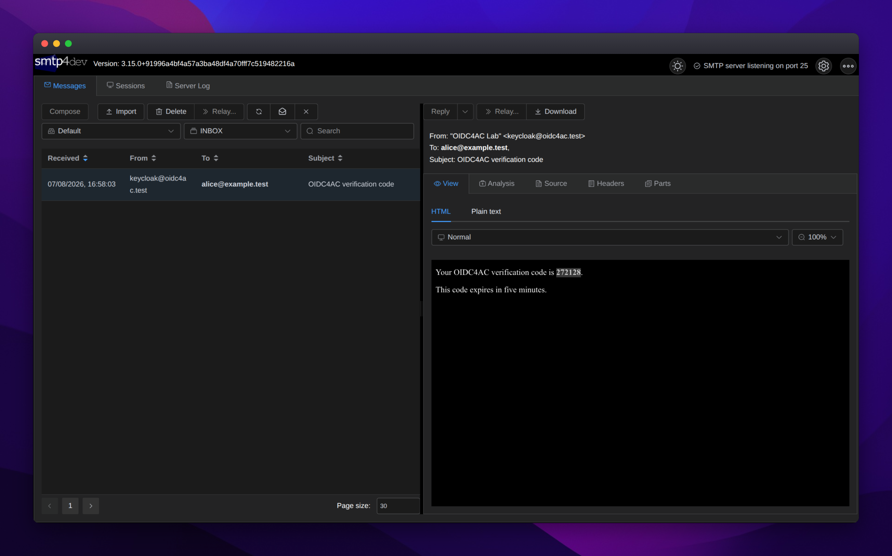
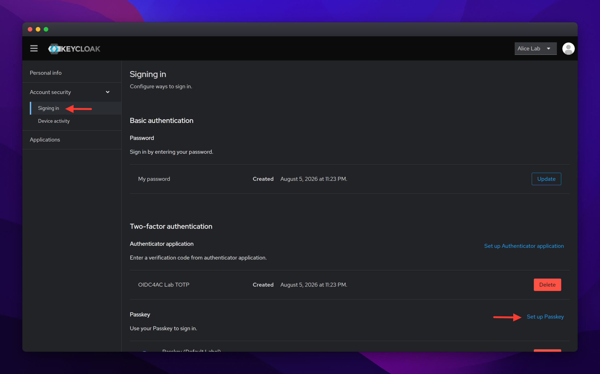

# Using the test client

The test client is a small Flask application that acts as both an RP and an
experiment workbench. It does not simulate responses: it sends a real OIDC
authorization to Keycloak, validates the response, and displays the received
data.

## Start the environment

From the repository root, run:

```bash
./dev.sh run
```

Open <http://client.localhost:5000>. Use `alice` / `Alice-password-123` when
Keycloak asks for credentials. To stop the lab, press `Ctrl-C` in the terminal
running the command or run `./dev.sh down` from another terminal.

## Run your first request

1. On the home page, keep the **Essential password** preset.
2. Keep **ID Token** selected and click **Start authorization**.
3. Sign in as Alice in Keycloak.
4. On the result page, compare the sent request, the OP Discovery document,
   and the `amr_details` claim in the ID Token.

The result should show the `pwd` method and when it was executed. This is the
simplest way to see that OIDC4AC describes the authentication that occurred,
rather than only token issuance.

<!-- Screenshot placeholder: replace docs/images/test-client-result.png with a
     current result-page capture showing the verified authentication context and
     the Factor tools navigation. -->


## Use the factor tools

The **Factor tools** link in the header groups the disposable helpers used by
the examples:

<!-- Screenshot placeholder: add docs/images/test-client-tools.png. Capture the
     Factor tools page with its OTP, email inbox, and WebAuthn cards visible. -->


- **OTP helper** shows Alice's current six-digit code and has a copy button. It
  updates the code through JavaScript only when the 30-second period changes,
  without reloading the page, so selecting or copying it is not interrupted.

<!-- Screenshot placeholder: add docs/images/test-client-otp.png. Capture the
     OTP code, countdown, Copy code button, and Back to factor tools link. -->


- **Email inbox** opens the smtp4dev viewer. The public hosted inbox is
  intentionally public and contains only disposable messages.

<!-- Screenshot placeholder: add docs/images/test-client-email-inbox.png. Capture
     a disposable verification message in smtp4dev; hide unrelated messages and
     any non-disposable addresses. -->


- **WebAuthn / passkey** opens Alice's Keycloak Account Console. Sign in with
  `alice / Alice-password-123`, choose **Security** (or **Signing in**) and
  register a passkey with the browser, platform authenticator, or security key.
  Return to the workbench and select a preset containing `pop`, such as the
  nested passkey preset. The browser will ask for the registered credential.

<!-- Screenshot placeholder: add docs/images/test-client-webauthn.png. Capture
     the Account Console security page where a passkey can be registered; use
     only the disposable Alice account. -->


The hosted service uses HTTPS, which is required by WebAuthn. Chrome, Edge,
Firefox, and Safari can use a platform passkey, a phone, or a USB security key;
the exact prompt depends on the user's device. The automated repository
browser profile uses a virtual CTAP2 authenticator instead and is independent
of the hosted account.

Each user should register a credential in their own browser profile. A
credential is stored by that browser/device and is not shared with other
profiles. The hosted instance nevertheless uses one shared Alice account, so all
registered passkeys remain valid for that account and are visible to the realm
administrator. This is convenient for a disposable demonstration, not an isolation
boundary for real users.

The client correlates every authorization with a unique OAuth `state` value and
keeps short-lived state server-side. Different users, browser profiles, and
parallel tabs therefore do not overwrite one another's pending request. A
result page also carries its own result identifier for refresh checks. This is
appropriate for the single-process disposable demo; it is not a replacement for
shared session storage or multi-node coordination in a production deployment.

## Discovery, builder, and JSON editor

Before it renders the interface, the client reads the issuer's OIDC Discovery
document. The identifiers, properties, and finite options suggested by the
builder therefore come from the running Keycloak instance — including methods
provided by a custom SPI.

The JSON editor is the source of truth: its contents are sent, without
conversion to a private format, as the OIDC `claims` parameter. The preview
button only helps inspect the JSON before authorization. Use the visual builder
to get started and the editor to test a specific request.

The presets cover password, OTP, passkey, email, nested expressions, and error
cases. For their expected behavior, copyable JSON, and an explanation of
`essential`, `all_of`, `one_of`, properties, and errors, see
[Usage flows](usage-flows.md).

## What the result page shows

The page shows the sent request, the Discovery document used by the builder,
the validated ID Token, and UserInfo when requested. It also exposes a
diagnostic view of the access token to confirm that `amr_details` is not copied
into it in this lab.

The client keeps data only for its local session and is designed for testing.
Do not use it directly as the basis for a production RP.
