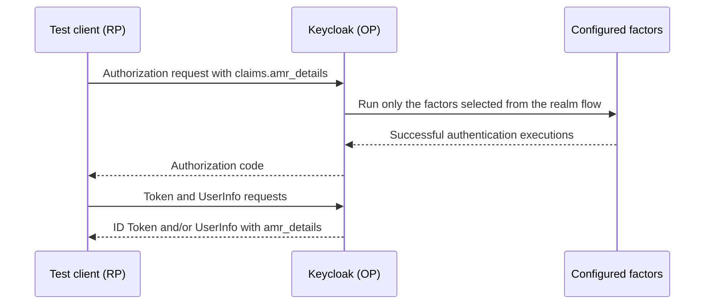

# OIDC4AC usage flows

This is the practical walkthrough for the lab. Run `./dev.sh run`, open the
test client at <http://client.localhost:5000>, and use the examples below to
connect the visual workbench to the protocol rules.



## 1. Discovery before requesting anything

The client first retrieves the realm's standard OIDC Discovery document:

```text
GET http://keycloak.localhost:8080/realms/oidc4ac/.well-known/openid-configuration
```

The OIDC4AC implementation augments that document. The important fields are:

```json
{
  "claims_supported": ["…", "amr_details"],
  "amr_details_request_supported": true,
  "amr_identifiers_supported": ["pwd", "otp", "pop", "email"],
  "pwd_properties_supported": ["…"],
  "otp_properties_supported": ["otp_algorithm", "otp_length", "…"],
  "email_properties_supported": ["email_verification_method"]
}
```

The exact lists are provider- and policy-dependent. A property being listed
means the OP understands it and may produce it when applicable; it does not
mean every user or execution has that property. Discovery value lists are used
only for finite string vocabularies. Numeric values, timestamps, objects,
identifiers, and open domains are described by their JSON type and semantics,
not enumerated.

The client uses these fields to populate the visual builder. An installed
custom `AuthenticationMethodDetailsProvider` can add a new method identifier,
properties, metadata, and finite value vocabulary without a test-client code
change.

## 2. A simple password request

Choose **Essential password**, keep **ID Token** selected, and click authorize.
The client sends a normal OIDC authorization-code request with a `claims`
parameter. The `claims` value is the JSON in the workbench editor; the browser
does not receive a second private request format.

The response page shows:

1. the request that was sent;
2. the Discovery document used by the builder;
3. the verified ID Token;
4. the access token's permitted claims; and
5. UserInfo, when requested and available.

The `amr_details` response is an array. A successful password event has the
shape below; the exact optional fields depend on the configured disclosure
policy and what the provider can establish truthfully:

```json
{
  "amr_details": [
    {
      "amr_identifier": "pwd",
      "amr_metadata": {
        "time": "2026-08-02T12:34:56Z"
      }
    }
  ]
}
```

`amr_identifier` and `amr_metadata.time` are mandatory for every returned
execution. The time is the actual method execution time, not token issuance
time.

## 3. Password and OTP with `all_of`

Select **pwd + otp (all_of)**. Alice already has a disposable TOTP credential;
the OTP helper in the header displays its current code. The request is
conceptually:

```json
{
  "id_token": {
    "amr_details": {
      "essential": true,
      "all_of": [
        { "amr_identifier": { "value": "pwd" } },
        { "amr_identifier": { "value": "otp" } }
      ]
    }
  }
}
```

Both factors are required. The browser factor planner selects the configured
`pwd` and `otp` subflows, and the normal Keycloak authenticators verify them.
The returned event retains both executions even if a delivery projection asks
for optional fields from only one method.

## 4. Alternatives with `one_of`

Select **pwd OR otp (one_of)**:

```json
{
  "id_token": {
    "amr_details": {
      "essential": true,
      "one_of": [
        { "amr_identifier": { "value": "pwd" } },
        { "amr_identifier": { "value": "otp" } }
      ]
    }
  }
}
```

At least one branch must match. The array order is not a preference and does
not force an execution order. The planner can attempt a feasible branch and,
if a non-cancellation failure occurs, advance to another branch present in the
immutable plan. An explicit user cancellation remains `access_denied`.

## 5. Nested expressions and four factors

Groups are recursive. The workbench includes `(pwd AND otp) OR pop` and
`pwd AND (otp OR email)` presets. A four-factor request is valid when all four
factor subflows are configured:

```json
{
  "id_token": {
    "amr_details": {
      "essential": true,
      "all_of": [
        { "amr_identifier": { "value": "pwd" } },
        { "amr_identifier": { "value": "otp" } },
        { "amr_identifier": { "value": "pop" } },
        { "amr_identifier": { "value": "email" } }
      ]
    }
  }
}
```

The request selects configured factors; it does not install them or alter the
realm flow. The realm administrator controls the available catalogue and
priority in **Authentication → Flows**.

## 6. Metadata and property constraints

`amr_metadata` describes the event and applies to every method execution.
`amr_properties` describes one method or credential. A request may ask for a
property without making it essential:

```json
{
  "amr_identifier": { "value": "otp" },
  "amr_metadata": { "time": null },
  "amr_properties": {
    "otp_algorithm": null,
    "otp_length": { "min": 6, "max": 8 }
  }
}
```

Optional event metadata is separate from method properties. If present,
`location` is a JSON object, not a display string:

```json
{
  "amr_metadata": {
    "time": "2026-08-02T12:34:56Z",
    "location": {
      "ip_address": "192.0.2.10",
      "country": "BR"
    }
  }
}
```

The provider must have evidence for each value and the realm/client disclosure
policy still applies. The lab's native adapters use only the request-context
network address when available; they do not derive a country or coordinates
from it.

`null` asks for a value when available and permitted. `value` and `values`
constrain an observed value; `min` and `max` constrain JSON numbers. A local
`essential: true` requires the corresponding field/property to be represented
and satisfied, but its scope is the leaf where it appears. The OP must never
write the requested value into the event if the actual execution did not
produce it.

An essential `max_age` applies only to `amr_metadata.time` and is a
non-negative integer. If an old SSO execution cannot satisfy it, Keycloak makes
an OP-controlled best-effort reauthentication attempt. The final event time
describes what actually happened.

## 7. Email provider flow

The lab's `email` factor is a separate Maven SPI project under
`providers/oidc4ac-test-email`. It sends a six-digit code through smtp4dev and
returns only safe, configured method details. To try it:

1. select an email preset;
2. authorize as Alice;
3. open <http://localhost:5080> in another tab;
4. copy the newest code into Keycloak; and
5. inspect the `email` execution and its disclosed properties on the result
   page.

The fixture demonstrates extensibility; it is not a production email service.
See [configuration-reference](configuration-reference.md) for the provider
build and [protocol-alignment](protocol-alignment.md) for the SPI boundary.

## 8. Different ID Token and UserInfo projections

The request language combines essential requirements from ID Token and UserInfo
conjunctively, but disclosure is evaluated separately. For example:

```json
{
  "id_token": {
    "amr_details": {
      "amr_identifier": { "value": "pwd" },
      "amr_metadata": { "time": null }
    }
  },
  "userinfo": {
    "amr_details": {
      "amr_metadata": { "iss": null, "location": null }
    }
  }
}
```

Both locations refer to the same complete Authentication Event snapshot. They
may differ in optional metadata and properties, and later UserInfo must reuse
that snapshot rather than reading mutable session history. Expression-based
disclosure never removes an execution from the preserved event.

## 9. Refresh, SSO, and re-check

The result page can refresh/re-check the grant. The expected behavior is:

- SSO reuse preserves the original execution times;
- refresh-derived tokens and UserInfo use the same grant snapshot;
- later authentication activity does not append methods to an old grant; and
- a failed new essential requirement returns the generic
  `unmet_authentication_requirements` response.

If a local refresh test returns `refresh_failed`, first ensure the original
authorization used the current test-client container and that the client has
not been rebuilt between authorization and refresh. See
[troubleshooting](troubleshooting.md).

## 10. Browser/passkey flow

The browser profile starts its own Keycloak/client pair and uses Chromium's
virtual CTAP2 authenticator:

```bash
./dev.sh test-browser
```

It registers a virtual passkey through the Account Console, then authorizes
real `pop` requests. This is the supported automated WebAuthn path in the lab;
the HTTP runner does not fake WebAuthn assertions or credential state.

## 11. Error cases worth trying

The workbench and E2E suites cover these deliberate failures:

- malformed or empty logical groups → `invalid_request`;
- missing mandatory request shape such as `amr_metadata.time` →
  `invalid_request`;
- unsupported essential method/property or unsatisfied essential constraint →
  generic `unmet_authentication_requirements`;
- ordinary cancellation/refusal by the End-User → `access_denied`; and
- OIDC4AC disabled for the realm → no OIDC4AC request-processing metadata and
  ordinary OIDC behavior.

Public errors must not reveal enrollment state, the unavailable method, the
verification failure, or the property that could not be disclosed.
